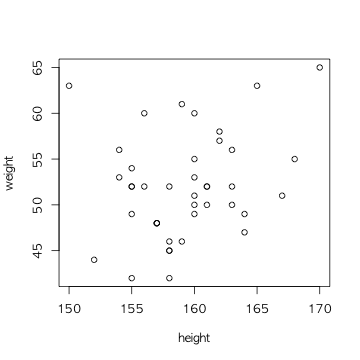
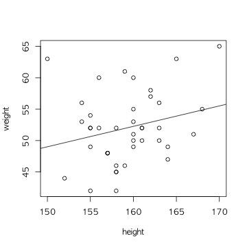
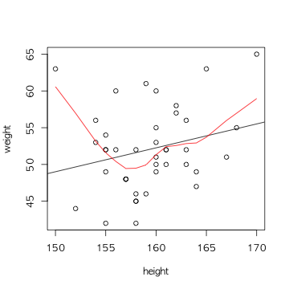
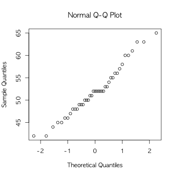
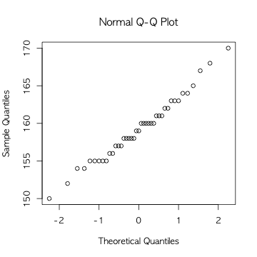
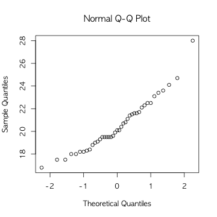

Quetelet's Body Mass Index
========================================================
작업환경 정리
--------------------------------------------------------
- 현재 작업디렉토리 찾아보기

```r
getwd()
```

```
## [1] "/Users/coop2711/Dropbox/works/class/Stat_Methods/R.WD"
```
- 검색가능한 package 와 data 열거

```r
search()
```

```
##  [1] ".GlobalEnv"        "package:knitr"     "package:stats"    
##  [4] "package:graphics"  "package:grDevices" "package:utils"    
##  [7] "package:datasets"  "KoreaEnv"          "package:methods"  
## [10] "Autoloads"         "package:base"
```
rn96.txt 자료 읽어들이고, 기초통계 요약하기
---------------------------------------
- rn96.txt 자료 읽어들이기, 원 자료를 보고 header 매개변수 추가

```r
rn96<-read.table("rn96.txt",header=TRUE)
```
- rn96 의 자료구조 살피기. 

```r
str(rn96)
```

```
## 'data.frame':	41 obs. of  2 variables:
##  $ height: int  161 155 158 170 160 156 162 158 158 167 ...
##  $ weight: int  50 49 42 65 60 52 58 46 45 51 ...
```
- height 와 weight 의 기초통계 살피기

```r
summary(rn96)
```

```
##      height          weight     
##  Min.   :150.0   Min.   :42.00  
##  1st Qu.:156.0   1st Qu.:48.00  
##  Median :159.0   Median :52.00  
##  Mean   :159.3   Mean   :52.02  
##  3rd Qu.:162.0   3rd Qu.:55.00  
##  Max.   :170.0   Max.   :65.00
```
- 평균과 표준편차만 살펴보려면

```r
apply(rn96,2,mean)
```

```
##    height    weight 
## 159.26829  52.02439
```

```r
apply(rn96,2,sd)
```

```
##   height   weight 
## 4.266289 5.667838
```
- height 와 weight 의 산점도 그리기

```r
plot(weight~height, data=rn96)
```

 
- 선형회귀선 추가하기

```r
plot(weight~height, data=rn96)
abline(lm(weight~height, data=rn96)$coefficient)
```

 
- 선형모형으로 분석하기

```r
lm(weight~height, data=rn96)
```

```
## 
## Call:
## lm(formula = weight ~ height, data = rn96)
## 
## Coefficients:
## (Intercept)       height  
##      0.2369       0.3252
```
- 회귀계수와 관련 통계량 살피기

```r
summary(lm(weight~height, data=rn96))
```

```
## 
## Call:
## lm(formula = weight ~ height, data = rn96)
## 
## Residuals:
##     Min      1Q  Median      3Q     Max 
## -9.6120 -3.2868 -0.5875  2.7622 13.9893 
## 
## Coefficients:
##             Estimate Std. Error t value Pr(>|t|)
## (Intercept)   0.2369    32.8626   0.007    0.994
## height        0.3252     0.2063   1.576    0.123
## 
## Residual standard error: 5.565 on 39 degrees of freedom
## Multiple R-squared:  0.0599,	Adjusted R-squared:  0.0358 
## F-statistic: 2.485 on 1 and 39 DF,  p-value: 0.123
```
- lowess 회귀선 추가하기

```r
plot(weight~height, data=rn96)
abline(lm(weight~height, data=rn96)$coefficient)
lines(lowess(rn96$height,rn96$weight),col="red")
```

 
- png 포맷으로 내보내기

```r
png("rn-plot.png",height=640,width=640)
plot(weight~height, data=rn96)
abline(lm(weight~height, data=rn96)$coefficient)
lines(lowess(rn96$height,rn96$weight),col="red")
dev.off()
```

```
## quartz_off_screen 
##                 2
```
BMI 계산하고 줄기-잎 그리기
---------------------------
- 조금 편하게 작업하기 위해서

```r
attach(rn96)
search()
```

```
##  [1] ".GlobalEnv"        "rn96"              "package:knitr"    
##  [4] "package:stats"     "package:graphics"  "package:grDevices"
##  [7] "package:utils"     "package:datasets"  "KoreaEnv"         
## [10] "package:methods"   "Autoloads"         "package:base"
```
- BMI 공식은 $\frac{몸무게(kg)}{키^2(m)}$

```r
rn96$BMI<-round(weight/(height/100)^2,digits=1)
head(rn96)
```

```
##   height weight  BMI
## 1    161     50 19.3
## 2    155     49 20.4
## 3    158     42 16.8
## 4    170     65 22.5
## 5    160     60 23.4
## 6    156     52 21.4
```
- 다음 작업이 왜 필요한지 생각해 볼 것.

```r
detach(rn96)
attach(rn96)
```
- BMI 값들의 줄기-잎 그림 그리기

```r
stem(BMI)
```

```
## 
##   The decimal point is at the |
## 
##   16 | 855
##   18 | 00223480135555569
##   20 | 11478145667
##   22 | 1355146
##   24 | 17
##   26 | 
##   28 | 0
```
- 조금더 알아보기 쉽게 매개변수를 바꾸기

```r
stem(BMI,scale=2)
```

```
## 
##   The decimal point is at the |
## 
##   16 | 8
##   17 | 55
##   18 | 0022348
##   19 | 0135555569
##   20 | 11478
##   21 | 145667
##   22 | 1355
##   23 | 146
##   24 | 17
##   25 | 
##   26 | 
##   27 | 
##   28 | 0
```
- 각 변수는정규분포에 가까울까?

```r
qqnorm(weight)
```

 

```r
qqnorm(height)
```

 

```r
qqnorm(BMI)
```

 
- weight와 height의 줄기-잎 그림

```r
stem(weight)
```

```
## 
##   The decimal point is at the |
## 
##   42 | 00
##   44 | 000
##   46 | 000
##   48 | 000000
##   50 | 00000
##   52 | 000000000
##   54 | 000
##   56 | 000
##   58 | 0
##   60 | 000
##   62 | 00
##   64 | 0
```

```r
stem(height)
```

```
## 
##   The decimal point is at the |
## 
##   150 | 0
##   152 | 0
##   154 | 0000000
##   156 | 00000
##   158 | 0000000
##   160 | 000000000
##   162 | 00000
##   164 | 000
##   166 | 0
##   168 | 0
##   170 | 0
```
