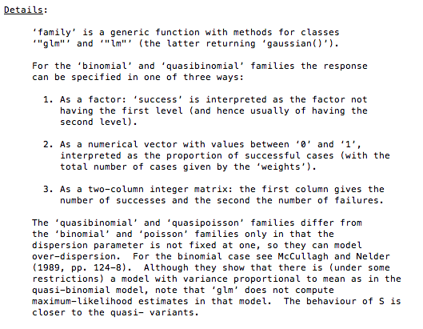

UCB Admissions Case
-------------------

1973년 UC Berkeley 대학원은 자신이 여성이라는 이유로 입학허가에서 차별을 받았다는 여성의 소송에 휘말렸다. 

```{r}
str(UCBAdmissions)
class(UCBAdmissions)
attributes(UCBAdmissions)
UCBAdmissions
```

Table and Data Frame에서 살펴본 바와 같이 3차원 array 구조를 가진 `UCBAdmissions`를 한 눈에 파악하기 위하여 `ftable()`을 이용하였다. 성별 입학허가를 비교하기 위하여 `Admit`과 `Gender`의 위치를 바꾸는 다양한 방법이 있음을 알 수 있다. 

```{r}
ftable(UCBAdmissions)
ftable(UCBAdmissions, row.vars=2:1)
ftable(UCBAdmissions, row.vars=c("Gender", "Admit"))
```
또한 `ftable()`로 만든 table이 $4\times6$ 매트릭스이고 `$dim`과 `$class` 외에도 `$row.vars`, `$col.vars` 요소를 포함하고 있다는 것을 알 수 있다.

```{r}
attributes(ftable(UCBAdmissions))
```

3차원 array에서 각 요소를 추출하는 방법은 다음과 같다. 우선 입학허가자 중 남자들만 뽑아보면,

```{r}
UCBAdmissions[1, 1, ]
```

와 같이 전공별로 주어짐을 알 수 있고, 입학허가자 전체를 살펴보면,  

```{r}
UCBAdmissions[1, , ]
```

와 같이 성별, 전공별로 나뉘어짐을 알 수 있다. 지원한 남자들을 입학허가 여부와 전공별로 나눠 보면,

```{r}
UCBAdmissions[, 1, ]
```
A전공과 B전공에 많은 인원이 지원하고 입학허가도 많이 나왔음을 알 수 있다.

여자들을 입학허가 여부와 전공별로 나눠 보면,

```{r}
UCBAdmissions[, 2, ]
```
남학생들이 많이 지원한 A전공과 B전공에는 적은 수효가 지원하였음을 알 수 있다. `apply()`를 이용하여 집계를 내는 방법에 대하여 알아보자. 우선, 입학허가 여부에 대하여 집계를 내어보면,

```{r}
apply(UCBAdmissions, 1, sum)
```

입학이 허가된 인원보다 그렇지 않은 인원이 훨씬 많았고, 남녀 지원자수의 합계를 비교해 보면

```{r}
apply(UCBAdmissions, 2, sum)
```

남학생이 더 많이 지원했음을 알 수 있다. 전공별 지원자수를 살펴보면,

```{r}
apply(UCBAdmissions, 3, sum)
```

A전공과 B전공에 많은 지원이 있었음을 알 수 있다. 남녀별, 입학허가 여부별로 집계해 보면, 

```{r}
apply(UCBAdmissions, c(1, 2), sum)
```

얼핏 윤곽은 파악되나, 자세한 내역은 백분률을 내어 봐야 함을 알 수 있다. 성별, 전공별 집계를 내어보면, 

```{r}
apply(UCBAdmissions, c(2, 3), sum)
```

A전공, B전공은 남학생이 윌등히 많이 지원하였고, C전공, E전공에는 여학생이 많이 지원했음을 알 수 있다.  입학허가 여부별, 전공별 집계를 내보면,

```{r}
apply(UCBAdmissions, c(1, 3), sum)
```

A전공, B전공은 쉽게 허가가 나오는 반면에 F전공은 매우 입학허가 나오기 어려운 전공임을 알 수 있다. 각 전공별로 남녀의 입학허가 및 탈락 비율을 비교하려면,

```{r}
options(digits=2)
prop.table(UCBAdmissions, margin=2:3)
```

와 같은 방법을 쓸 수 있다. `margin=2:3`이 전공별, 성별을 의미한다는 것을 알 수 있다. 한 눈에 파악할 수 있도록 `ftable()`을 사용하되 `margin=2:3`으로 하여 성별, 전공별로 입학허가여부의 비율을 합하면 1이 되도록 하였다.

```{r}
ftable(prop.table(UCBAdmissions, margin=2:3))
```

성별, 입학허가율을 비교하기 위하여 `row.vars=2:1`로 하여 순서를 바꾼다.

```{r}
ftable(prop.table(UCBAdmissions, margin=2:3), row.vars=2:1)
```

이 중 입학허가율만 비교한다면,

```{r}
prop.table(UCBAdmissions, margin=2:3)[1, , ]
```

임을 알 수 있어서 오히려 여자들의 입학허가율이 전공별로는 더 높거나 거의 같은 수준임을 알 수 있다. 이는 그 위의 결과를 이용하여

```{r}
ftable(prop.table(UCBAdmissions, margin=2:3))[1:2,]
```

라고 하여도 되지만 이름을 잃어버린다. 한편 전체적으로는 

```{r}
options(digits=3)
prop.table(apply(UCBAdmissions, c(1, 2), sum), margin=2)
```

남자들의 입학허가율이 여자들의 입학허가율보다 높다. 이는 다음 식으로부터 보다 확실히 알 수 있다. 

```{r}
prop.table(apply(UCBAdmissions, c(1,2), sum), margin=2)[1, ]
```

전공별 지원자를 집계해 보면,

```{r}
apply(UCBAdmissions, 3, sum)
```

성별, 전공별 입학허가율만 따로 떼어 내면,

```{r}
prop.table(UCBAdmissions, margin=2:3)[1, , ]
```

전공별 지원자수를 새로운 R object로 저장하고,

```{r}
total.applicants.major<-apply(UCBAdmissions, 3, sum)
```

총 지원자수를 또 다른 R object로 저장한다.

```{r}
total.applicants<-sum(total.applicants.major)
total.applicants
```

남녀별 입학허가율을 새로운 R 객체로 저장하면, 

```{r}
admitted.rates.m.major<-prop.table(UCBAdmissions,margin=2:3)[1, 1, ]
admitted.rates.f.major<-prop.table(UCBAdmissions,margin=2:3)[1, 2, ]
```

남자의 전공별 입학허가율은,

```{r}
admitted.rates.m.major
```

이고, 여자의 전공별 입학허가율은,

```{r}
admitted.rates.f.major
```

으로 계산되어 여자들의 입학허가율이 높거나 대체로 비슷함을 알 수 있다. 이 여섯 개의 입학허가율을 전공별 지원자수를 가중치로 고려한 하나의 입학허가율로 계산하면,

```{r}
admitted.rates.m<-sum(admitted.rates.m.major*total.applicants.major)/total.applicants
admitted.rates.f<-sum(admitted.rates.f.major*total.applicants.major)/total.applicants
c(male=admitted.rates.m, female=admitted.rates.f)
```

와 같이 계산되어 전공을 고려하지 않고 계산한 남녀별 입학허가율과는 반대의 결과가 나온다.


GLM Approach with Cases Data Frame
----------------------------------

입학허가 여부를 이항 변수로 보고, 성별과 학과를 독립변수로 보는 `glm` 모델을 생각해보자. 이 모델을 적합시키려면 case 별로 기록된 data frame이 필요하다. 입학허가에 성별 차이가 있는지 파악하기 위하여 logit을 link로 하는 binomial family에 적합시켜 보자.

```{r}
load("UCB_glm.rda")
UCB.glm.1<-glm(Admit~Gender, family=binomial(link="logit"), data=UCBAdmissions.cases)
UCB.glm.1
summary(UCB.glm.1)
```

성별의 계수가 통계적으로 매우 유의하게 나오고 있어서 남녀 간 입학허가의 가능성에 차이가 있음을 알 수 있다. 이를 회귀계수를 중심으로 보다 자세히 살펴보면 

```{r}
coef(UCB.glm.1)
```

이 값은 바로 $\log\frac{(1-p_{female})/p_{female}}{(1-p_{male})/p_{male}}$ 에 해당한다. 이는 R의 `glm()`에서 success를 취급하는 방식에 기인하는데 이를 `binomial()`의 help 파일에서 인용하면 다음과 같다.



위에서 계산한 바 있는 남성과 여성의 전체 입학허가율을 이 식에 대입해 보면 같은 값을 얻게 된다. 

```{r}
p.gender<-prop.table(xtabs(Freq ~ Admit+Gender, data = UCBAdmissions.df), margin=2)
p.gender
log(p.gender[2,2]/p.gender[1,2]/(p.gender[2,1]/p.gender[1,1]))
```

log(odds ratio) 로 의미 파악이 잘 안되면 `exp()`을 취하여 살펴볼 수도 있다.

```{r}
exp(coef(UCB.glm.1))
```

즉,  학과를 고려하지 않았을 때 여성 불합격률의 odds가 남성보다 1.8배 높다는 의미이다. 이는 남성 입학허가율의 odds가 여성보다 1.8배 높다는 의미이기도 하다. 

성별 차이에다 학과별 차이를 고려한 모델은

```{r}
UCB.glm.2<-glm(Admit~Gender+Dept, family=binomial(link="logit"), data=UCBAdmissions.cases)
UCB.glm.2
summary(UCB.glm.2)
```

이제, 성별 차이는 더 이상 유의하지 않고, 학과별 차이(C, D, E, F)가 지배적이다. 성별 분석과 마찬가지로 계수를 살펴보면,

```{r}
coef(UCB.glm.2)
```

이제 성별차이는 거의 없다는 것, 오히려 여성들이 약간 더 유리하다는 것을 다음 odds ratio로 확인할 수 있다. 여성들의 불합격률의 odds ratio는 남성 불합격률 odds ratio의 90% 수준이라는 의미이다.

```{r}
exp(coef(UCB.glm.2)["GenderFemale"])
```

학과별 입학허가 가능성(사실은 R의 binomial family 구성에 따라 불합격 가능성)은 기준인 A학과와의 비교로 이루어진다. B학과의 경우 

```{r}
exp(coef(UCB.glm.2)["DeptB"])
```

로 A학과보다 약간 높다는 것을 알 수 있는 데, 이는 성별을 고려한 입학허가율(혹은 불합격률)에 있어서 남자들의 경우

```{r}
matrix(data=male.admissions, nrow=2, ncol=6, dimnames=dim.names.UCB)
```

여자들의 경우

```{r}
matrix(data=female.admissions, nrow=2, ncol=6, dimnames=dim.names.UCB)
```

이었던 점을 감안하여 각각의 입학허가율(혹은 불합격률)을 성별 지원자를 가중치로 넣은 가중평균으로 계산한 결과로부터 비교할 수 있는 일이다. 즉, 

```{r}
c(male=admitted.rates.m, female=admitted.rates.f)
```

이므로, 여성불합격률과 남성불합격률의 odds ratio의 비는 

```{r}
((1-admitted.rates.f)/admitted.rates.f)/((1-admitted.rates.m)/admitted.rates.m)
```

로 나와 회귀계수로부터 예상한 결과와 대체적으로 부합한다.

성별, 학과별 지원자수는 

```{r}
applicants.gender.dept<-table(UCBAdmissions.cases[c("Gender","Dept")])
applicants.gender.dept
```

로부터 확인가능하다. 예를 들어서 A학과의 입학허가율은 

```{r}
A.admissions<-(male.admissions[1,1]*applicants.gender.dept[1,1]+female.admissions[1,1]*applicants.gender.dept[2,1])/colSums(applicants.gender.dept)[1]
A.admissions
```

B학과의 입학허가율은 

```{r}
B.admissions<-(male.admissions[1,2]*applicants.gender.dept[1,2]+female.admissions[1,2]*applicants.gender.dept[2,2])/colSums(applicants.gender.dept)[2]
B.admissions
```

로 계산되어 불합격률의 odds ratio, $\frac{1-B.admissions}{B.admissions}=$ `r (1-B.admissions)/B.admissions`와 비교했을 때 예상했던 대로 A학과 불합격률의 odds, `r (1-A.admissions)/A.admissions`보다 약간 높다. 그밖에 다른 학과들의 입학허가율을 지원자수를 고려한 가중평균으로 계산하면,

```{r}
(male.admissions[1,3]*applicants.gender.dept[1,3]+female.admissions[1,3]*applicants.gender.dept[2,3])/colSums(applicants.gender.dept)[3]
(male.admissions[1,4]*applicants.gender.dept[1,4]+female.admissions[1,4]*applicants.gender.dept[2,4])/colSums(applicants.gender.dept)[4]
(male.admissions[1,5]*applicants.gender.dept[1,5]+female.admissions[1,5]*applicants.gender.dept[2,5])/colSums(applicants.gender.dept)[5]
(male.admissions[1,6]*applicants.gender.dept[1,6]+female.admissions[1,6]*applicants.gender.dept[2,6])/colSums(applicants.gender.dept)[6]
```

로 계산되어 학과별 odds비교가 가능해진다. F학과의 경우 C학과와 비교했을 때,

```{r}
F.C<-exp(coef(UCB.glm.2)["DeptF"])/exp(coef(UCB.glm.2)["DeptC"])
names(F.C)<-"F to C odds ratio"
F.C
```

만큼 불합격률의 odds가 차이날 것으로 판단되는 데 이는 $\frac{(1-0.0644)/0.0644}{(1-0.351)/0.351}=$ `r (1-0.0644)/0.0644/((1-0.351)/0.351)`로 쉽게 확인된다.

`anova`로 두 모델 간의 차이를 분석하면

```{r}
anova(UCB.glm.1, UCB.glm.2, test="Chisq")
```

즉, 학과별 영향을 고려하면서 성별 영향은 사라진 모델이 적합함을 알 수 있다. 이와 같은 방식으로 제3의 변수가 주는  영향을 파악할 수 있다. 

이와 같은 경우, case별로 재구성한 data frame이 필요하다. 

물론 counts로 구성한 data frame 으로도 `glm` 분석이 가능하다.

GLM (data frame with Counts)
--------------------------

`binomal family`를 갖는 `glm` 에 맞추려면 `UCBAdmissions.df`에서 `$Admit`의 `"Admitted"`와 `"Rejected"`를 별도의 변수로 떼 내어야 한다. 

```{r}
UCBAdmissions.df
```

`Admitted`를 `Admit=="Admitted"`를 테스트하는 논리변수라하면, 

```{r}
Admitted<-UCBAdmissions.df$Admit=="Admitted"
```
Admitted와 Rejected를 새로운 Counts 변수로 갖는 data frame은, 

```{r}
UCBAdmissions.df.2<-data.frame(UCBAdmissions.df[Admitted, 2:3], Admitted=UCBAdmissions.df[Admitted, 4], Rejected=UCBAdmissions.df[!Admitted, 4]) 
UCBAdmissions.df.2
```

이렇게 새로이 만든 data frame에 다음과 같은 모델을 적용한다.

```{r}
UCB.glm.3<-glm(cbind(Admitted, Rejected)~Gender, family=binomial(logit), data=UCBAdmissions.df.2)
```

data frame with cases로 분석하였을 때와의 차이점은 `"Admitted"`를 `success`로 보고 있다는 점이다. 따라서 회귀계수의 부호가 반대로 나올 것으로 예측할 수 있다.

```{r}
summary(UCB.glm.3)
```

부호가 바뀐 점을 제외하면 회귀계수가 동일함을 확인할 수 있다. 전공을 고려하면,

```{r}
UCB.glm.4<-glm(cbind(Admitted, Rejected)~Gender+Dept, family=binomial(logit), data=UCBAdmissions.df.2)
```

이 또한 부호만 바뀌고 회귀계수는 동일하다.

```{r}
summary(UCB.glm.4)
```

`anova`로 두 모델 간의 차이를 분석하면,

```{r}
anova(UCB.glm.3, UCB.glm.4, test="Chisq")
```

이 역시 같은 분석 결과를 얻는다.

GLM (data frame with Proportion)
--------------------------------

이번에는 남자의 합격비율을 계산하여 모델에 넣는다.

```{r}
UCB.total<-UCBAdmissions.df.2$Admitted+UCBAdmissions.df.2$Rejected
UCBAdmissions.df.2$P.Admitted<-UCBAdmissions.df.2$Admitted/UCB.total
UCBAdmissions.df.2
```

`glm`에 넣으려면 각 전공별 지원자수(`UCB.total`)를 `weights=`에  설정해 주어야 한다.

```{r}
UCB.glm.5<-glm(P.Admitted~Gender, family=binomial(logit), data=UCBAdmissions.df.2, weights=UCB.total)
```

data frame with counts를 활용한 분석과 같은 결과를 얻는다.

```{r}
summary(UCB.glm.5)
```

전공별 상황까지 고려하면, 

```{r}
UCB.glm.6<-glm(P.Admitted~Gender+Dept, family=binomial(logit), data=UCBAdmissions.df.2, weights=UCB.total)
```

이 역시 data frame with counts를 활용한 분석과 같은 결과가 나왔다.

```{r}
summary(UCB.glm.6)
```

이 역시 `anova`로 분석하면,

```{r}
anova(UCB.glm.5, UCB.glm.6, test="Chisq")
```

같은 결과를 얻게 된다.

Smoking and Survival
--------------------

1972년부터 1974년 사이에 영국의 위컴(Whickham)에서 선거등록부에 올라와 있는 주민 여섯 명 1명 꼴로 실시한 조사결과와 그로부터 20년 후에 실시한 추수조사(follow-up study)결과를 비교한다. 자료를 읽어들여서 data frame으로 저장한다. 

```{r}
s<-read.table("Smoking_simpson.txt", stringsAsFactors=TRUE)
str(s)
s
```

변수들에 이름을 주고,

```{r}
names(s)<-c("Age", "Smoking", "Survived", "Counts")
s
```

사실상 ordered factor인 `"Age"`를 제대로 규정해 주고,

```{r}
s$Age<-factor(s$Age, ordered=TRUE)
str(s)
```

연령대별로 흡연여부와 생존여부를 살펴본다.

```{r}
xtabs(Counts~Survived+Smoking+Age,data=s)
```

연령대를 고려하지 않고 집계하면,

```{r}
xtabs(Counts~Survived+Smoking,data=s)
```

흡연여부와 생존률의 관계를 살피기 어려우므로,

```{r}
options("digits"=2)
prop.table(xtabs(Counts~Survived+Smoking, data=s), margin=2)
```

놀랍게도 흡연자들의 생존률이 비흡연자들의 생존률보다 높게 나타나고 있다. 그러나 연령대별로 나눠보면,

```{r}
prop.table(xtabs(Counts~Survived+Smoking+Age, data=s), margin=c(2, 3))
```

어느 연령대에서나 비흡연자의 생존률이 높게 나와서 이 또한 전형적인 Simpson's Paradox에 해당함을 알 수 있다. 생존률만 일목요연하게 비교할 수 있으려면, `prop.table`을 이용할 수 있는데,

```{r}
prop.table(xtabs(Counts~Survived+Smoking+Age, data=s), margin=c(2, 3))[2, , ]
```

`ftable`을 사용할 경우

```{r}
ftable(prop.table(xtabs(Counts~Survived+Smoking+Age, data=s), margin=c(2, 3)))
```

전체를 살펴보는 데는 문제가 없지만, 일부분을 추출하면

```{r}
ftable(prop.table(xtabs(Counts~Survived+Smoking+Age, data=s), margin=c(2, 3)))[1:2, ]
```

이름을 잃어버린다. 이 자료도 `glm`을 사용하여 분석할 수 있다. 

```{r}
Not.Survived<-s$Survived=="no"
s.2<-data.frame(s[Not.Survived,1:2], Not.Survived=s[Not.Survived, 4], Survived=s[!Not.Survived, 4])
s.2
```

`binomial family`에 `logit`을 link로 하는 `glm`에 적합시키자. 먼저, 흡연여부에 대해서만 파악해 보면 

```{r}
s.glm.3<-glm(cbind(Survived, Not.Survived)~Smoking, family=binomial(logit), data=s.2)
summary(s.glm.3)
```

회귀계수를 다시 살펴보면,

```{r}
coef(s.glm.3)
```

비흡연자(Smokingx)의 생존률 log(odds ratio)가 더 낮게 나오는 것을 확인할 수 있다. 보다 구체적으로 `exp()`를 취해 보면,

```{r}
exp(coef(s.glm.3))
```

이는 앞에서 계산한,

```{r}
s.rates.1<-prop.table(xtabs(Counts~Survived+Smoking, data=s), margin=2)
s.rates.1
```

로부터 

```{r}
(s.rates.1[2,2]/s.rates.1[1,2])/(s.rates.1[2,1]/s.rates.1[1,1])
```

와 일치한다. 연령대를 고려하면, 

```{r}
s.glm.4<-glm(cbind(Survived, Not.Survived)~Smoking+Age, family=binomial(logit), data=s.2)
summary(s.glm.4)
```

흡연여부는 더 이상 유의하지 않고, 연령대가 유력한 요인으로 등장한다. 회귀계수의 분석은 생략하고, `anova`로 분석하면,

```{r}
anova(s.glm.3, s.glm.4, test="Chisq")
```

연령대가 유의한 요인임을 확인한다.

Titanic Survival Rates in 3rd Class and Crew
--------------------------------------------

3등성과 선원들에 한해서 여성들의 생존률을 분석하시오. 

```{r}
str(Titanic)
apply(Titanic, c(1,2), sum)
apply(Titanic, c(1,2), sum)[3:4,]
apply(Titanic, c(1,4), sum)[3:4,]
options(digits=2)
apply(Titanic, c(1,2,4), sum)
apply(Titanic, c(1,2,4), sum)[3:4,,]
ftable(apply(Titanic, c(1,2,4), sum)[3:4,,])
ftable(apply(Titanic, c(1,4,2), sum)[3:4,,])
ftable(apply(Titanic, c(1,4,2), sum)[3:4,,])[1:2,]
ftable(apply(Titanic, c(1,4,2), sum)[3:4,,])[3:4,]
prop.table(ftable(apply(Titanic, c(1,4,2), sum)[3:4,,])[1:2,], margin=2)
prop.table(ftable(apply(Titanic, c(1,4,2), sum)[3:4,,])[3:4,], margin=2)
matrix(prop.table(ftable(apply(Titanic, c(1,4,2), sum)[3:4,,])[1:2,], margin=2), nrow=2,  dimnames=list(dimnames(Titanic)$Survived, dimnames(Titanic)$Sex))
matrix(prop.table(ftable(apply(Titanic, c(1,4,2), sum)[3:4,,])[3:4,], margin=2), nrow=2,  dimnames=list(dimnames(Titanic)$Survived, dimnames(Titanic)$Sex))


